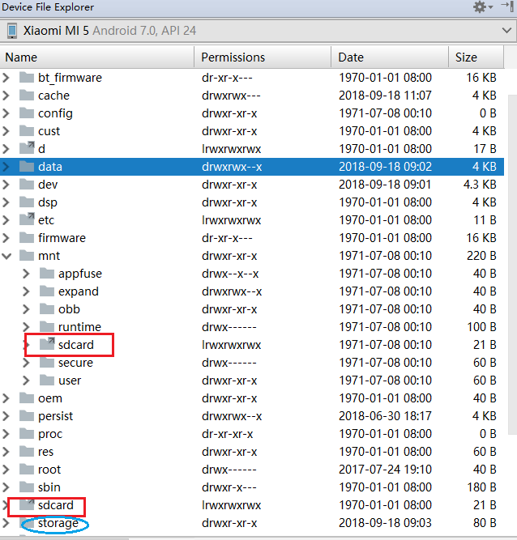

android文件内部存储和外部存储
---
### 内部存储
&emsp;&emsp;


### 外部存储

&emsp;&emsp;虽然被称为“外部存储”，但实际上仍是手机内部的存储设备，与内部存储不同，外部存储通常都能被所有应用程序访问到，类似于公共文件夹的形式。官方描述如下：  

```latex
	don't be confused by the word "external" here. This directory can better be thought as media/shared storage. It is a filesystem that can hold a relatively large amount of data and that is shared across all applications (does not enforce permissions). Traditionally this is an SD card, but it may also be implemented as built-in storage in a device that is distinct from the protected internal storage and can be mounted as a filesystem on a computer.
```
&emsp;&emsp;实际上，通俗地说，可以这么理解，外部存储就是手机上的File System。打开手机的文件管理，里面的文件夹都属于外部存储，都位于手机的sdcard目录下。
&emsp;&emsp;接下来继续介绍sdcard，在Android Studio上的Device File Explorer上可以看到包括外部存储和内部存储。如图，其中data属于内部存储，sdcard是外部存储。但在图中发先不可思议的是有2个sdcard目录，那外部存储到底指的是哪个sdcard目录呢？  

  
<center>图1.android手机内外存储系统</center>  
&emsp;&emsp;其实这两个文件夹都不是，或者说都是，这两个文件夹后面有Permissions一列，这是Linux文件系统的权限符，其中第一个字母 L 是指当前文件/目录的类型是软链接文件（类似于windows的快捷方式），所以这两个文件夹都是软链接目录，并非真正的sdcard文件夹，它们都被称为挂载点。  
&emsp;&emsp;通过查阅相关资料发现真正的sdcard文件夹是storage/emulated/0这一文件夹，storage/emulated/0是手机sd卡被挂载的目录，也是当前手机默认的外部存储的根目录。所以当调用`Environment.getExternalStorageDirectory()`方法时，返回到的就是该目录，对于不同的手机，返回的路径可能不一样，原因就在于有的手机除了带有手机自身的sd卡外，还有外置的tf存储卡。有的时候是外置的sd卡在被挂载状态下，这时`Environment.getExternalStorageDirectory()`方法获取到的就是其它的外置存储卡了。  
&emsp;&emsp;所以总结一下，为了方便理解，只要认为`Environment.getExternalStorageDirectory()`获取的是当前外部存储的根目录就可以了。